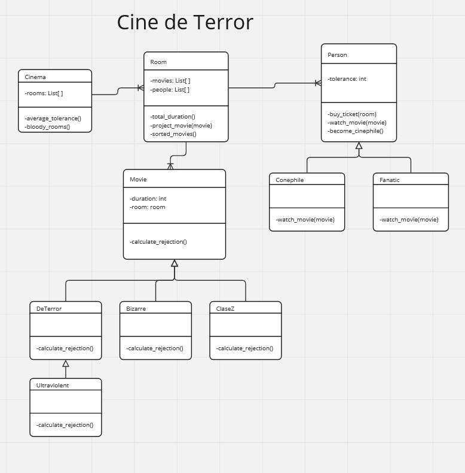

### Parcial de Paradigmas de Programación V

### Contexto:

Se acerca el ‘Buenos Aires Rojo Sangre’ y los organizadores nos pidieron
hacer un sistema para controlar la venta de entradas. El complejo cuenta
con varias salas en las cuales se proyectan diferentes películas. Cada sala
exhibe más de una película. Los horarios están organizados en base a los
géneros: Bizarro, DeTerror y ClaseZ. 

La entrada se vende por día - es un pase con el cual la persona tiene un lugar 
en la sala durante ese día y tiene acceso a todas las películas proyectadas. 
Las entradas no están numeradas. De cada película se conoce su duración en minutos.
Como estas son películas para personas especiales, no todo el mundo las
puede ver, al que no está preparado, les produce cierto rechazo (medido
en puntos):

- Todas las películas ClaseZ producen un rechazo de 2 puntos. 
- Las DeTerror producen un rechazo de 3 puntos por cada 5 minutos de
duración. 
- Cada Bizarra produce un rechazo igual a la cantidad de personas en la
sala en este momento.

Cada persona tiene un nivel distinto de tolerancia hacia lo que ve, que
también medimos en puntos y se va decrementando de acuerdo a los
puntos que produce el rechazo del corto o película.

Sin embargo no todos sienten el mismo rechazo por una película:
- Los cinéfilos sienten la mitad del rechazo.
- Para los más fanáticos sólo sienten rechazo si la película produce más
de 30 puntos de rechazo.
Una persona puede convertirse de un día para el otro en cinéfilo o
fanatico, o dejar de serlo de repente.

Realizar código para:
1. Saber si a una persona le conviene comprar entradas para una sala.
A una persona le conviene comprar, si las películas y cortos
exhibidos en esa sala tienen una duración menor a 120 minutos y
no está muy apretado (Una persona está muy apretada en la sala si
la cantidad de personas en la sala es mayor a 100).
2. Hacer que una persona compre una entrada para una sala. La
persona comprará la entrada si le conviene, si no le conviene, no se
hace nada. Una vez que la persona compró la entrada para una
sala, se entiende como que ya está ubicada en ella.
3. Que una sala proyecte una película. Cuando una sala proyecta una
película el nivel de tolerancia de las personas comienza a disminuir
de acuerdo al rechazo que la película produce. Si la tolerancia llega
a 0, la persona se retira del cine.
4. Luego de reproducir la película convertir a un espectador en
Cinéfilo.
5. Se debe realizar consultas para conocer:
   1. Dada una sala, devolver las películas que proyecta, ordenadas
      según su duración, de mayor a menor.
   2. Devolver la tolerancia promedio de las personas que se
      encuentran en todo el complejo. 
   3. Devolver las salas sangrientas. Es sangrienta si tiene alguna
      película que produce un rechazo de al menos 50 puntos en
      todos los espectadores.
6. Agregar un nuevo tipo de películas - las Ultraviolentas. Éstos tiran
chorros de sangre hacia el público cada 15 minutos, lo que duplica
el rechazo de una película De Terror.

