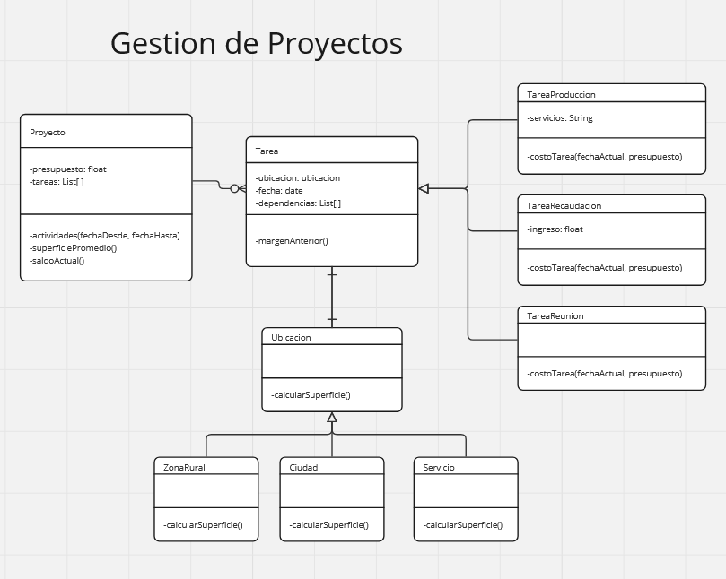

### Gestión de Proyectos
Desarrollar (realizar workspace, diagrama de clases y código) de acuerdo al paradigma de objetos
el modelo para una aplicación de gestión de proyectos.
La aplicación deberá poder manejar varios proyectos; cada proyecto se compone de un conjunto de
tareas. Para cada tarea se indica:

- fecha en la que se va a hacer; para simplificar el modelo, suponemos que todas las tareas
llevan exactamente un día.
- en dónde se va a hacer:
  - algunas tareas se hacen en oficina, se indica la dirección de la oficina,
  - algunas tareas se hacen en toda una ciudad, p.ej. acciones de marketing,
  - algunas tareas se hacen en una zona rural, p.ej. cosechar en un campo.
- de qué otras tareas depende, o sea que tienen que hacerse antes.

Es importante tener en cuenta el saldo de un proyecto, que permite que se puedan llevar a cabo
sus tareas. Cada proyecto nace con un presupuesto inicial; luego el saldo va variando en función
de las tareas que incluye.

Hay: tareas de producción, tareas de recaudación, y reuniones.
- Las tareas de producción implican un gasto, que es la suma del costo de los servicios que
se usan, que se indica para cada tarea. El costo de cada servicio se indica
explícitamente, y es independiente de la tarea: p.ej. si digo que el servicio de desinfección
cuesta 45 pesos, ese valor es el mismo para todas las tareas en las que se incluya el
servicio de desinfección.
- Las tareas de recaudación implican un ingreso, que se indica explícitamente.
- Las reuniones no implican ni gasto ni ingreso.

Las tareas se cargan, todas, desde un archivo externo, la carga queda fuera de lo que hay que
modelar. Lo que hay que hacer es definir qué objetos deben crearse, de forma tal que se pueda
cumplir con los requerimientos respecto de los proyectos que ya están cargados con todos sus
datos.

### Los requerimientos son:
1. Saber en qué provincias va a haber actividad de un proyecto para un rango de fechas. De
cada oficina se sabe la ciudad, de cada ciudad y zona rural se sabe la provincia.
2. Saber la superficie promedio en la que se desarrollan las tareas de un proyecto. Para las
oficinas se establece una superficie, la misma para todas en m2.
Para las ciudades se informa explícitamente la superficie en m2.
Las zonas rurales se asumen como rectangulares; se informa ancho y largo.
3. Saber el saldo de un proyecto a una fecha, que debe tener en cuenta todas las tareas hasta
esa fecha inclusive.
4. Saber si se puede hacer una tarea; la condición es que todas las tareas de las que depende
deben tener una fecha anterior. Para las tareas de producción, además, el saldo del
proyecto a la fecha en que se hace la tarea debe ser no negativo (o sea, >= 0).
5. Saber si un proyecto es coherente; es coherente si pueden hacerse todas las tareas en la
fecha indicada.
6. Saber el margen anterior de una tarea, que es la cantidad de días entre que se hace la
última de las tareas de las que depende, y el día indicado para esa tarea. Si la tarea no
depende de ninguna, su margen anterior es 0.

