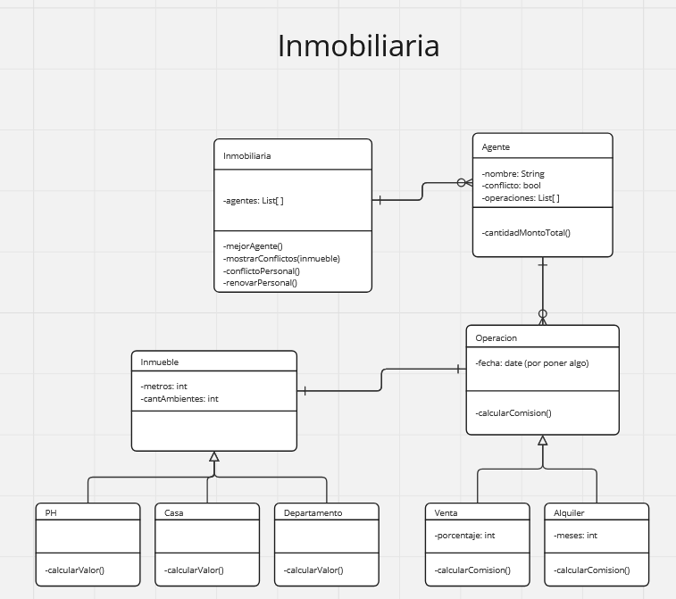

## PARADIGMAS DE PROGRAMACIÓN V

Inmobiliaria Maduro, también conocida como “InMaduro” a causa de sus despistados
agentes inmobiliarios, necesita empezar a organizar algo mejor a sus empleados, que están
siempre mirando pajaritos y viendo cosas raras hasta en las paredes. Con este fin (el de
organizar, no el de ver cosas raras), nos contactó a nosotros para lograr su objetivo.
El sistema deberá llevar un registro de las operaciones que realizó la inmobiliaria, que
pueden ser alquileres o ventas de un determinado inmueble. Sobre cada operación se
conoce el inmueble y el nombre del cliente. Además el agente tiene que cobrar una
comisión.

- Para los alquileres, se conoce la cantidad de meses por la que se pacta el contrato
de alquiler, y la comisión que le corresponde al agente es igual a M / 5000 del valor
del inmueble, siendo M la cantidad de meses de alquiler.
- Para una venta, en cambio, se tiene un porcentaje sobre el valor del inmueble,
siempre igual para todos los agentes de la inmobiliaria. El año pasado, este valor era
1%, aunque este año es de 1,5% y el año que viene... ¿quién sabe?

De todos los inmuebles se conoce el tamaño en metros cuadrados y la cantidad de
ambientes. Por otra parte, el valor de cada inmueble, según esta particular inmobiliaria, no
es algo tan directo:

- Si es una casa, tiene un valor particular para esa casa.
- Los PH tienen un valor de 4.000 por metro cuadrado, con un mínimo de 50.000.
- Los departamentos se tasan a 35.000 por ambiente.

### Se pide realizar:
1. Saber cuál fue la comisión de una operación (venta o alquiler).
2. Saber cuál fue el agente que mejor trabaja según el monto total de las comisiones
que le corresponden por las operaciones.
3. Realizar una venta y un alquiler.

