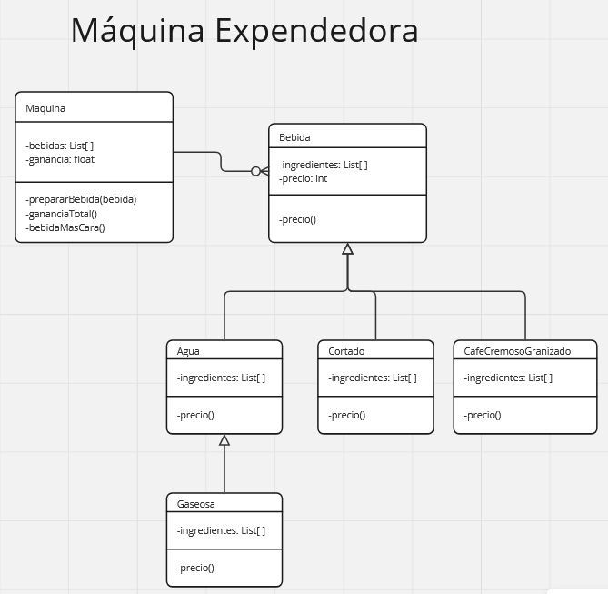

### Paradigmas de Programación V

### Contexto:

Se busca crear un software que funcione en una máquina expendedora
de bebidas con distintas configuraciones de bebidas. Es decir,no todas las
máquinas van a tener la misma configuración de bebidas!

Las máquinas expendedoras pueden producir diferentes bebidas, por
ejemplo: un vaso con agua, cortado, granizado de café cremoso, gaseosa.
De cada bebida se conocen sus ingredientes, por ejemplo: el vaso de
agua lleva solo agua, mientras que para hacer un granizado de café
cremoso se utilizan leche, café, azúcar morena y canela, para el cortado
café y leche y las gaseosas son agua, saborizante y gas.
Las máquinas le cobran al usuario por cada bebida servida. Se sabe que
hoy un vaso de agua cuesta 50 pesos, cualquier gaseosa siempre cuesta
el triple que el vaso de agua, mientras que el cortado 250 y los granizados
cuestan 50 pesos por cada ingrediente que llevan. Las máquinas registran
lo que le cobran al usuario por cada bebida servida.

Realizar código para:
1. Preparar un vaso de gaseosa y un “Granizado de café cremoso”
2. Calcular el valor de recaudación total de una máquina.
3. Encontrar la bebida más cara que puede ofrecer una máquina
según su configuración.

