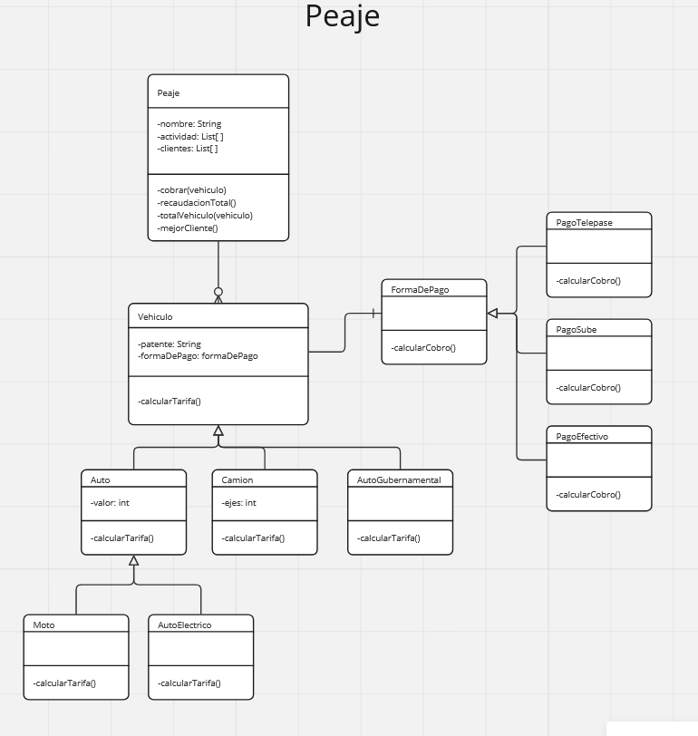

Paradigmas de Programación V

## Contexto:

Se sabe que en una autopista se cobra peaje a los vehículos que la usan.
Los autos y camiones tienen diferentes formas de calcular la tarifa: para
el auto es un valor único ($100) mientras que en los camiones $200 por
cada eje, las motos pagan la mitad del valor del auto. Y además hay
diferentes formas de pago: con telepeaje “Pass”, con la tarjeta Sube y en
efectivo (50%, 70%, %100 del valor estándar respectivamente). Se tienen
que registrar los cobros de peaje con el valor cobrado y la patente del
vehículo.

Realizar código para:

1. Cobrar a un auto con “SUBE”, una moto en efectivo y un camión de
3 ejes con “Pass”.
2. Calcular el valor de recaudación total de los peajes.
3. Encontrar la patente del mejor cliente, sería aquel que más gastó en
los peajes.
4. Agregar tarifa especial para autos eléctricos (20% de un auto
común), y otra de $0 para cualquier tipo de vehículo
gubernamental.

